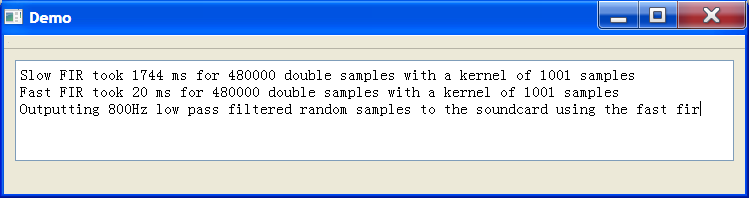

# FastFIR
1D real fast FIR filtering.
It's really fast compared to slow filtering!!!

##API usage with Qt

Include `qjfastfir.h` and compile and link with `qjfastfir.cpp`

```C++
//create pointer
QJFastFIRFilter *fastfir;

//create FastFIR filter
fastfir = new QJFastFIRFilter(this);

//set the kernel of the filter, in this case a Low Pass filter at 800Hz
fastfir->setKernel(JFilterDesign::LowPassHanning(800,48000,1001));

//process data (data is QVector<kffsamp_t>, eg "QVector<kffsamp_t> data;")
fastfir->Update(data);
```

##API usage with standard C++

Include `jfastfir.h` and compile and link with `jfastfir.cpp`

```C++
//create pointer
JFastFIRFilter *fastfir;

//create FastFIR filter
fastfir = new JFastFIRFilter;

//set the kernel of the filter, in this case a Low Pass filter at 800Hz
fastfir->setKernel(JFilterDesign::LowPassHanning(800,48000,1001));

//process data (data is vector<kffsamp_t>, eg "vector<kffsamp_t> data;")
fastfir->Update(data);

//delete FastFIR filter
delete fastfir;
```

##Getting started

Clone/Download repository.

Demo project requires at least Qt5.
Open [FastFIR/Demo/Demo.pro](FastFIR/Demo/Demo.pro) with Qt creator and run.
Demo compares slow FIR and fast FIR times and low pass filter's noise at 800Hz and outputs this to the default soundcard device.



##Filters designs included

The class JFilterDesign contains the following filter designs as static member functions

* LPF *Low Pass Filter*
* HPF *High Pass Filter*
* BPF *Band Pass Filter*
* BSF *Band Stop Filter*

The static members for the Qt version are as follows where frequencies are in Hz and Samplerate is in samples per second.

```C++
QVector<kffsamp_t> JFilterDesign::LowPassHanning(double FrequencyCutOff, double SampleRate, int Length);
QVector<kffsamp_t> HighPassHanning(double FrequencyCutOff, double SampleRate, int Length);
QVector<kffsamp_t> BandPassHanning(double LowFrequencyCutOff,double HighFrequencyCutOff, double SampleRate, int Length);
QVector<kffsamp_t> BandStopHanning(double LowFrequencyCutOff,double HighFrequencyCutOff, double SampleRate, int Length);
```

These designs return the kernel for use with the FastFir. For example, to create a BPF that has a FIR length of 1001 that covers 1000Hz to 2000Hz and a Samplerate of 48000bps then following code can be used.

```C++
...
//set the kernel of the filter, in this case a BPF from 1kHz to 2kHz
fastfir->setKernel(JFilterDesign::BandPassHanning(1000,2000,48000,1001));
...
```

##QJFastFIRFilter member Update

The QJFastFIRFilter class contains the public member function "Update" that does the processing of the raw input signal/data. Its prototype is as follows.

```C++
int Update(QVector<kffsamp_t> &data);
```

It is designed so that it reads "data", filteres it, then replaces "data" with the filtered responce. It performs internal buffering so that no matter how much data is given to "Update", "Update" will replace every item in "data". Basicly this makes it eaiser to design applications.

Update's return value is the number of items in data that it has replaced. This should always be equal to the size of "data" and only serves as a check.

Jonti 2015
http://jontio.zapto.org


